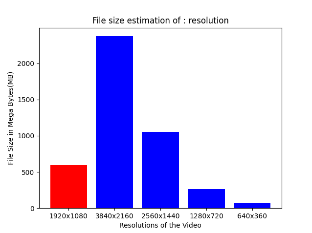

# media-filesize-estimator

<div align="center">

[](https://pypi.org/project/media-filesize-estimator/)
[](https://pypi.org/project/media-filesize-estimator/)
[](https://github.com/kHarshit/media-filesize-estimator/actions?query=workflow%3Abuild)
[](https://github.com/kHarshit/media-filesize-estimator/pulls?utf8=%E2%9C%93&q=is%3Apr%20author%3Aapp%2Fdependabot)


Estimates media file size in different formats w/o actually converting the file

</div>


## Installation

The package works with python 3.8+.

```bash
pip install -U media-filesize-estimator

# or install with `Poetry`
poetry add media-filesize-estimator
```

Then you can run

```bash
media-filesize-estimator --help

# or with `Poetry`:
poetry run media-filesize-estimator --help
```

## Working

```
$ media-filesize-estimator --help
Usage: media-filesize-estimator [OPTIONS]

  Estimates media file size in different formats w/o actually converting the
  file

Options:
  -m, --media TEXT           Media file path  [required]
  -p, --property TEXT        Parameter (resolution/frame_rate/bit_depth/sampli
                             ng_rate/channels) to compare
  -sf, --save-format TEXT    Format (json/xml/csv) to save media metadata
  -sl, --save-location TEXT  Location to save media metadata and/or graph
                             [default: ./]
  -v, --version              Prints the version of the media-filesize-
                             estimator package.
  --help                     Show this message and exit.
```

```
$ media-filesize-estimator --media assets/sample_video_redfort.mp4 --property resolution --save-location /tmp/ --save-format xml
The given media file is of type : video
Extracting data from file : sample_video_redfort.mp4
Extraction completed successfully to file : /tmp/sample_video_redfort.xml
Metadata is saved at /tmp/sample_video_redfort.xml
The given media file is of type : video
Uncompressed file size estimation of the given file in MB with resolution 1920x1080 : 593.262 MB
Uncompressed file size estimation of the given file in MB with resolution 3840x2160 : 2373.047 MB
Uncompressed file size estimation of the given file in MB with resolution 2560x1440 : 1054.688 MB
Uncompressed file size estimation of the given file in MB with resolution 1920x1080 : 593.262 MB
Uncompressed file size estimation of the given file in MB with resolution 1280x720 : 263.672 MB
Uncompressed file size estimation of the given file in MB with resolution 640x360 : 65.918 MB
Plotting the graph for the given parameter : resolution
Estimated filesize graph saved at /tmp//estimated_filesize.png
```



## Contributing

Thanks for considering contributing to this project. Please follow [Contributing guidelines](https://github.com/kHarshit/media-filesize-estimator/blob/main/CONTRIBUTING.md).

## 🛡 License

[](https://github.com/kHarshit/media-filesize-estimator/blob/main/LICENSE)

This project is licensed under the terms of the `MIT` license. See [LICENSE](https://github.com/kHarshit/media-filesize-estimator/blob/main/LICENSE) for more details.

## 📃 Citation

```bibtex
@misc{media-filesize-estimator,
  author = {kHarshit, Pappuru-Dinesh, TejodhayBonam, AbdulBasitA},
  title = {Estimates media file size in different formats w/o actually converting the file},
  year = {2022},
  publisher = {GitHub},
  journal = {GitHub repository},
  howpublished = {\url{https://github.com/kHarshit/media-filesize-estimator}}
}
```

### Credits 

This project was generated with [`python-package-template`](https://github.com/TezRomacH/python-package-template)
